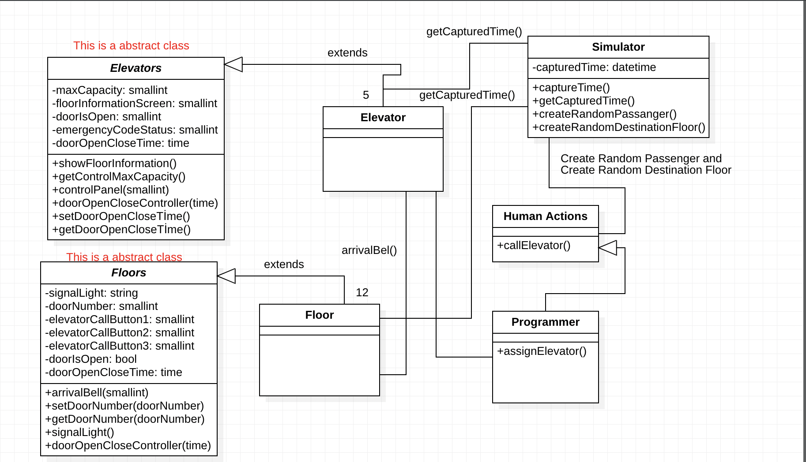

# Elevator-Simulation-Project

[Patika.dev](https://www.patika.dev/tr)

Asansör Simülasyonunun, belirtilen kriterlerce UML-Design kullanılarak yazılım sisteminin ifade edildiği projedir.

---

**Sistem İçin Belirtilen Kriterler**

```

Aşağıdaki problem ifadesine göre bir sınıf diyagramı tasarlayın.

Nesne Yönelimli Programlamanın ilkelerini ve sınıflar arası ilişki durumlarını kullanmaya çalışın. (Encapsulation, Inheritance, Polymorphism, Abstraction)

Kodluyoruz Sigorta Şirketi 12 katlı bir ofis binası inşa etmek ve onu en son asansör teknolojisi ile donatmak istiyor. Şirket, bina içindeki trafik akışı ihtiyaçlarını karşılayıp karşılamayacaklarını görmek için binanın asansörlerinin işlemlerini modelleyen bir yazılım simülatörü oluşturmanızı istiyor.

Binada, her biri binanın 12 katına çıkabilecek beş asansör bulunacaktır. Her asansörün yaklaşık altı yetişkin yolcu kapasitesi vardır. 
Asansörler enerji tasarruflu olacak şekilde tasarlanmıştır, bu nedenle yalnızca gerektiğinde hareket ederler. 
Her asansörün kendi kapısı, kat gösterge ışığı ve kontrol paneli vardır. Kontrol panelinde hedef düğmeleri, kapı açma ve kapama düğmeleri ve bir acil durum sinyal düğmesi bulunur.

Binadaki her katta, beş asansör boşluğunun her biri için bir kapı ve her kapı için bir varış zili vardır. 
Varış zili, asansörlerin bir kata vardığını gösterir. 
Her kapının üzerinde bulunan bir sinyal ışığı, asansörün gelişini ve asansörün hareket ettiği yönü gösterir. Her katta ayrıca üç set asansör çağrı düğmesi vardır.

Bir kişi uygun çağrı düğmesine (yukarı veya aşağı) basarak bir asansörü çağırır. Bir programlayıcı, aramanın başladığı kata gitmek için beş asansörden birini görevlendirir. 
Asansöre girdikten sonra, bir yolcu tipik olarak bir veya daha fazla hedef düğmesine basar. 
Asansör kattan kata hareket ederken, asansörün içindeki bir gösterge ışığı yolcuları asansörün konumu hakkında bilgilendirir. 
Bir asansörün bir kata varması, dış asansör kapısının üzerindeki gösterge lambasının yakılması ve kat zilinin çalmasıyla belirtilir. 
Bir asansör bir katta durduğunda, her iki kapı grubu da önceden belirlenmiş bir süre boyunca otomatik olarak açılarak yolcuların asansöre girip çıkmalarına izin verir.

Simülatör, gerçek zaman geçişini simüle etmek ve simülasyonda meydana gelen olayları zaman damgası ve günlüğe kaydetmek için bir "saat" kullanır. 
Simülatör tarafından yolcu oluşturmak ve her yolcu için kalkış ve varış katlarını belirlemek için rastgele bir sayı üreteci kullanılır.


```

---

## İstenen Tasarımın UML Çıktısı

Aşağıda, istenen tasarımın UML programı kullanılarak (StarUML) gerçekleştirilmiş hali bulunmaktadır.

Projeye ait ekran görüntüsünü paylaştıktan sonra, tasarımda ifade edilmek istenenleri de resmin altına açıklama satırı olarak yazacağım.




---

**Elevators Abstract Class**

1. Elevators Class'ı abstract class olarak oluşturulmuştur. Bu class'a bağlı olan diğer asansör class'ları abstract class'ın metotlarını ve değişkenlerini inheritance olarak almışlardır.
Class içerisinde ki attribute'lar private olarak tanımlanmıştır.

2. Kontrol paneli içerisinde ki kapı açma ve kapama ve acil durum sinyal düğmeleri class'ın içerisinde ki controlPanel(smallint) metoduyla sağlanmaktadır.
Bu metod dışarıdan bir parametre alarak kapıyı açma, kapatma veya acil durum sinyalini gönderebilir.

**Floors Abstract Class**

1. Floor class'ları kat bilgilerini Floors Abstract Class'ı içerisinde bulunan getDoorNumber methodundan alırlar.

2. Floor Class'ı burada Elevator class'ıyla haberleşip kat bilgisini Elevator Class'a göndererek arrivalBel()
varış zili metodunun çalışmasını sağlar. 


**Human Actions Class**

1. Bir çağrı düğmesine basılıp asansörün çağrılmasından dolayı Human Actions class'ı Programmer Class'ını tetikler.
Programmer Class'ı da Elevator Class'ını tetiklemiş olur.

2. Elevator Class'ı çalıştırıldığı anda, herhangi bir kata vardığında dış asansör kapısının üzerinde ki gösterge lambasının yanmasına signalLight() metodu ve varış zilinin ( arrivalBel() ) çalmasına sebep olur.

3. Asansör bir katın kapısında durduğunda Floor class'ının içindeki doorControl(time) metodu açılıp kapanma süresini okuyarak kat kapısının parametreye gönderilen süre açık veya kapalı kalmasını sağlar. Açık veya kapalı olmasına 
doorIsOpen attribute'na bakılarak karar verilir.

**Simulator Class**

1. Simulator Class'ı rastgele sayıda yolcu ve rast gele gidilecek kat bilgisini üretir.

2. Ardından Human Action class'ını tetikleyerek kriterlerde belirtilen tüm senaryonun çalışmasını sağlar.